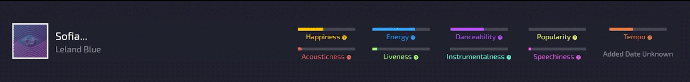
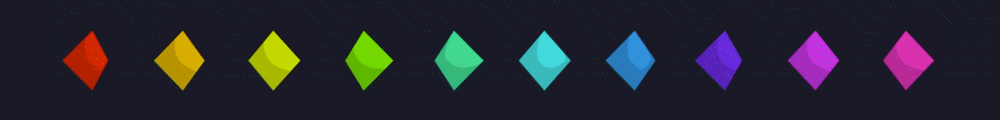

  </img>

  1st place winner for <a href="https://beaverhacks-winter-2022.devpost.com/">Oregon State Beaverhacks Winter 2022</a>!

  <a href="https://spotify-cartography.vercel.app/">Live Site</a>
  ·
  <a href="https://www.youtube.com/watch?v=SSZak8W_P88">Video Demo</a>
  ·
  <a href="https://beaverhacks-winter-2022.devpost.com/">Hackathon</a>

---

Spotify Cartography groups simular songs together based on their *happiness*, *energy*, *danceability* and other variables using an algorithm called **t-distributed stochastic neighbor embedding (t-SNE)**.

Your songs are then displayed in a 3D space using Three.js, allowing you to fly around and explore. *Hover* songs to see their details, and *Shift + Click* them to play them on your current Spotify playback device.

You control the parameters passed to t-SNE, as well as how heavly to weight the nine variables it takes into account.

You can also choose a variety of options on what data to visualize. Select all your liked songs, a subset, a variety of albums, artists or playlists, your top listened for different time ranges, or simply use samples provided.

  </img>

- [Inspiration](#inspiration)
- [Your 3D Space](#your-3d-space)
  - [Controls](#controls)
  - [Song Details](#song-details)
  - [Rotational Speed](#rotational-speed)
  - [Color of Points](#color-of-points)
- [Usage](#usage)
  - [Authentication](#authentication)
  - [What songs would you like to visualize?](#what-songs-would-you-like-to-visualize)
  - [Data Collection](#data-collection)
  - [The Algorithm](#the-algorithm)
  - [Re-Running t-SNE](#re-running-t-sne)
  - [Weights and Preferences](#weights-and-preferences)
- [Development](#development)

  </img>

I love music, but navigating my music library has always been a challenge. I have almost [400 playlists](https://open.spotify.com/user/12146574234?si=e32247afac004aa5) on Spotify and keep on adding more songs. I'm always looking for better ways to organize my music.

I've been obsessed with [Spotify's API](https://developer.spotify.com/documentation/web-api/) for a while.

It not only offers access to my entire library but also [statistics on each song that Spotify has generated using machine learning](https://developer.spotify.com/documentation/web-api/reference/#/operations/get-several-audio-features). Spotify can tell you how *happy* a song is, how *energetic* it is, what's the *likelihood it was performed live* is, and other cool statistics.

While making charts of my happiest or least energetic songs is entertaining, I've always wanted to apply [t-SNE](https://www.youtube.com/watch?v=wvsE8jm1GzE) to the data to see how it'd pan out.

  </img>

Every point you see on your 3D map is a song. The bottom will display details on any song you hover, and has a few tabs to open on the right side.

Your frame rate is displayed at the top-right. This is mostly impacted by the number of points you have on the screen.

---

  </img>

<h2>
  <b>
    Controls
  </b>
</h2>

Use your mouse to move around the scene. Currently there isn't support for touchscreens and VR, but hopefully that can be added soon!

**Rotate**: Hold *Left Click* and move your mouse to rotate around the origin, which is default to the center of the 3D space.

**Pan**: Hold *Right-Click* and move your mouse to move the origin.

**Zoom**: Use the *Scroll-Wheel* to zoom closer and farther from the origin. You can also press down your middle mouse button and move your mouse up and down.

**Play Song**: You can *Control + Click* or *Shift + Click* to play a song. You must be logged into Spotify, and have Spotify playing music on any device for it to work.

---

  </img>

<h2>
  <b>
    Song Details
  </b>
</h2>

You can hover over any song to see it's details at the bottom, including it's cover art, name and artists.

You'll also be shown nine variables such as the song's *happiness* or *energy*. These are the variables that were used to map the point.

If applicable, Spotify Cartographer will also show the date it was added.

---

  </img>

<h2>
  <b>
    Rotational Speed
  </b>
</h2>

The **speed at which points rotate** is based on their *energy*. While this choice was arbitrary, it should give you a better idea of what kind of songs are clustered.

This rotation is disabled when t-SNE to give your poor computer a break.

---

  </img>

<h2>
  <b>
    Color of Points
  </b>
</h2>

The **color of a point** changes based on the query made.

- Your Top Listened
  - Color is based on position on your top listened chart.
- Liked Songs
  - Color is based on when the song was added.
- Playlists
  - One Playlist
    - Color is based on position in the playlist.
  - Multiple Playlists
    - Color is based on the playlist each song is from.
- Albums
  - One Albums
    - Color is based on position in the album.
  - Multiple Albums
    - Color is based on the album each song is from.
- Artists
  - One Artist
    - One Album
      - Color is based on position in the album.
    - Multiple Albums
      - Color is based on the album each song is from.
  - Multiple Artists
    - Color is based on the artist each song is from.

  </img>

<h2 id="authentication">
  <b>
    I. Authentication
  </b>
</h2>

Login to Spotify Cartography with your Spotify account.

Alternatively, you can use sample data without being logged in.

<h2 id="what-songs-would-you-like-to-visualize">
  <b>
    II. What songs would you like to visualize?
  </b>
</h2>

Once authenticated, you'll be presented with a menu. You have complete control over what songs you'd like to visualize.

- Your Top Listened
  - Visualize your top fifty played songs over the course of several years, several months, or several weeks.
- Liked Songs
  - Visualize your entire saved library, or a subset using the **limit** and **offset** parameters.
- Playlists
  - Select one or more playlists to visualize. This allows you to display the natural order of a playlist, or compare two playlists.
- Albums
  - Select one or more albums to visualize. This could be used to compare two simular albums and where they differ / intersect.
- Artists
  - Select one or more artists to visualize. This allows you to see how an artist's albums have changed over time, or compare two simular artists and where they differ / intersect.
- Sample Data
  - If you don't have a Spotify premium account, or would rather not login / deal with parameters, feel free to explore a few of the samples provided.

<h2 id="data-collection">
  <b>
    III. Data Collection
  </b>
</h2>

Once you've selected your method of query, Spotify Cartography will request every song, as well as their **audio features**. These audio features include:

- Level of happiness
- Level of energy
- Level of danceability
- Chance the song is acoustic
- Chance the song is instrumental
- Chance the song is live
- How much speech the song contains
- Estimated tempo
- Popularity of the song

<h2 id="the-algorithm">
  <b>
    IV. The Algorithm
  </b>
</h2>

Spotify Cartography uses these parameters, and nothing else, to map songs in your 3D space.

It does this by using an algorithm called t-SNE to estimate those nine variables into three (x, y, z) to be plotted. This method is not perfect, and the parameters passed into t-SNE matter a ton.

If you're not into math or coding here's a [video](https://www.youtube.com/watch?v=wvsE8jm1GzE) to help you understand what t-SNE does!

<h2 id="re-running-t-sne">
  <b>
    V. Re-Running t-SNE
  </b>
</h2>

Once Spotify Cartography has loaded all the data, it will run t-SNE once and show you your 3D space.

**This won't be enough** and you won't find many interesting relationships.

Click the **Algorithm** tab to change t-SNE's parameters and re-run the algorithm. It's best to bump up **iterations** to 1,000. This is how many times t-SNE will be run. 

When you're ready, you can click the **Run** button. In the top left of your screen, you'll see details on the progress.

**Further parameter changes**:

*It's hard to predict how many times you'll have to run t-SNE, but the results tend to stabilize after many iterations.*

*You can play around with **epsilon** (learning rate) and **perplexity** (guess at the number of close neighbors each point has). You can [read more on these here](https://distill.pub/2016/misread-tsne/). I recommend you play around with these, perplexity is said to be best at around `numberTracks ** 0.5`.*

<h2 id="weights-and-preferences">
  <b>
    VI. Weights and Preferences
  </b>
</h2>

The nine variables mentioned early might not all interest you!

A 3D space showing the *happiness* and *energy* of tracks can yeild better results when the *popularity* of a song is disregarded.

Click the **Preferences** tab at the bottom to change how heavlily each variable is weighed during evaluation.

Changes are saved as soon as they are made, so once you're done you can go back to the **Algorithm** tab and re-run t-SNE.

  </img>

The website was built using [Vue.js](https://vuejs.org/); I'm a big fanboy of Vue. The [Vuex](https://vuex.vuejs.org/) store was used for most data, as it's global and allows me to manage the mutation of the data.

The 3D graphics were done using [Three.js](https://threejs.org/). There's a lot to learn and plenty more optimization to be done as far as the 3D scene. I'm new to 3D libraries so I did whatever was quick and dirty!

I used the [Spotify API](https://developer.spotify.com/documentation/web-api/) to request [saved tracks](https://developer.spotify.com/documentation/web-api/reference/#/operations/get-users-saved-tracks) and [audio features](https://developer.spotify.com/documentation/web-api/reference/#/operations/get-several-audio-features). The chef's kiss was adding [Spotify's Web Playback SDK](https://developer.spotify.com/documentation/web-playback-sdk/), which allows the website to become a playback device, and receive real-time data on playback. Pain to implement, tiny small additional features. The only benefit really is avoiding rate limits.

The npm library [@keckelt/tsne](https://www.npmjs.com/package/@keckelt/tsne?activeTab=dependents) was used for processing the data. At first, I was interested in implementing it myself based on the [papers I found](https://www.jmlr.org/papers/volume9/vandermaaten08a/vandermaaten08a.pdf), but shortly realized it was best left for another time.

Most of the development of Spotify Cartography took place over the three day hackaton it was built for. Past that, I decided to add some features and clean up the code.
